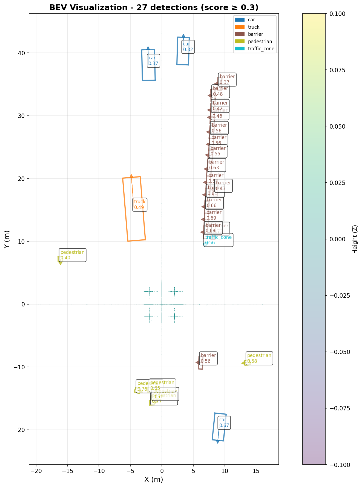

## Project Overview

**BEVMF** (Bird's-Eye View Model Framework) is a comprehensive framework for **BEV-based 3D object detection** models. This project focuses on evaluating and comparing state-of-the-art Bird's-Eye View detection models, including **BEVFusion**, PointPillars, 3DSSD, and CenterPoint.

### What is BEV (Bird's-Eye View)?

BEV (Bird's-Eye View) is a top-down representation of 3D scenes that projects 3D objects onto a 2D plane, making it easier to understand spatial relationships and object positions. BEV-based models are particularly effective for autonomous driving applications as they provide a unified representation that combines information from multiple sensors (LiDAR, cameras).

### Key Features

The framework provides:
- **BEV visualization** tools for top-down view analysis
- **Multi-model comparison** across KITTI and nuScenes datasets
- **Comprehensive evaluation metrics** (mAP, precision, recall, IoU)
- **Automated artifact export** (point clouds, bounding boxes, predictions, visualizations)
- **BEVFusion support** with custom CUDA operations compilation

The core driver is `mmdet3d_inference2.py`, a customized version of OpenMMLab's inference script with enhanced BEV visualization and export utilities. The `scripts/visualize_bev.py` script generates detailed Bird's-Eye View visualizations of detection results.

> 📊 **See [REPORT.md](REPORT.md) for comprehensive evaluation results, metrics, and analysis of all models.**

## Prerequisites

1. **Python 3.10** – installed via Microsoft Store (`winget install Python.Python.3.10`).
2. **Virtual environment** – created in the repo root: `py -3.10 -m venv .venv`.
3. **NVIDIA GPU (optional but recommended)** – for CUDA acceleration (GTX 1650 or better recommended).
4. **CUDA Toolkit 11.3+** – for GPU support (PyTorch will use CUDA 11.8 which is compatible).

### Activate Environment (PowerShell)
```powershell
& .\.venv\Scripts\Activate.ps1
```

### Install Dependencies

#### Option 1: CPU-Only Setup (Limited - PointPillars only)
```powershell
python -m pip install -U pip
pip install -r requirements.txt
pip install torch==2.1.2+cpu torchvision==0.16.2+cpu torchaudio==2.1.2+cpu \
    --index-url https://download.pytorch.org/whl/cpu
```

#### Option 2: CUDA Setup (Recommended for BEV Models)
```powershell
python -m pip install -U pip
pip install -r requirements.txt
pip install torch==2.1.2 torchvision==0.16.2 torchaudio==2.1.2 \
    --index-url https://download.pytorch.org/whl/cu118
# Install mmcv with CUDA support (required for mmdet3d)
pip uninstall mmcv -y
pip install mmcv==2.1.0 -f https://download.openmmlab.com/mmcv/dist/cu118/torch2.1.0/index.html
```

#### Install mmdet3d in Development Mode (Recommended)
Install mmdet3d from the external directory to use the latest fixes:
```powershell
cd external/mmdetection3d
python setup.py develop
cd ../..
```

#### Compile BEVFusion CUDA Operations (Required for BEVFusion)
After installing dependencies, compile BEVFusion's custom CUDA operations:
```powershell
cd external/mmdetection3d/projects/BEVFusion
python setup.py develop
cd ../../..
```

> **Note:** If BEVFusion CUDA compilation fails due to missing CUDA toolkit or Visual Studio, the model can still run inference using CPU fallback, though it will be slower.

**Verify CUDA Installation:**
```powershell
python -c "import torch; print('CUDA available:', torch.cuda.is_available()); print('GPU:', torch.cuda.get_device_name(0) if torch.cuda.is_available() else 'N/A')"
```

> **Note:** We pin NumPy 1.26.x and OpenCV 4.8.1 to match the prebuilt MMDetection3D sparse ops. Installing in this order prevents ABI conflicts.

## Repository Layout

```
scripts/
  export_kitti_calib.py        # Converts KITTI demo PKL to calib txt
  open3d_view_saved_ply.py     # Local Open3D visualization helper
  visualize_bev.py             # BEV (Bird's-Eye View) visualization generator
mmdet3d_inference2.py          # Enhanced MMDetection3D inference script
fix_bevfusion_checkpoint.py   # Fixes BEVFusion checkpoint shape mismatches
compare_models_metrics.py      # Model comparison and metrics evaluation
external/mmdetection3d         # Upstream repo (includes BEVFusion project)
  projects/BEVFusion/          # BEVFusion BEV-based fusion model
data/                          # Prepared KITTI / nuScenes demo inputs
outputs/                       # All inference artifacts (including BEV visualizations)
checkpoints/                   # Pretrained model weights
requirements.txt               # Python dependencies
```

## Initial Data Prep

Demo inputs come from the cloned `external/mmdetection3d/demo/data/` directory. Before running inference:

1. **Copy KITTI sample**
   ```powershell
   Copy-Item external\mmdetection3d\demo\data\kitti\000008.bin data\kitti\training\velodyne\
   Copy-Item external\mmdetection3d\demo\data\kitti\000008.png data\kitti\training\image_2\
   Copy-Item external\mmdetection3d\demo\data\kitti\000008.txt data\kitti\training\label_2\
   python scripts/export_kitti_calib.py `
     external/mmdetection3d/demo/data/kitti/000008.pkl `
     data/kitti/training/calib/000008.txt
   ```

2. **Copy nuScenes sample**
   ```powershell
   Copy-Item external\mmdetection3d\demo\data\nuscenes\*CAM*jpg data\nuscenes_demo\images\
   Copy-Item external\mmdetection3d\demo\data\nuscenes\n015-2018-07-24-11-22-45+0800__LIDAR_TOP__1532402927647951.pcd.bin `
     data\nuscenes_demo\lidar\sample.pcd.bin
   ```

3. **Download nuScenes Mini Dataset (Optional - for nuScenes mini inference)**
   The nuScenes mini dataset is required for running inference on nuScenes mini samples. Download it from the [nuScenes website](https://www.nuscenes.org/download) and extract it to the `data/` directory. The dataset should be extracted so that the structure is:
   ```
   data/
     v1.0-mini/
       samples/
         LIDAR_TOP/
           *.pcd.bin
       sweeps/
       maps/
       ...
   ```
   After extraction, the path `data/v1.0-mini/samples/LIDAR_TOP/` should contain the LiDAR point cloud files.

## Download Pretrained Models

Use OpenMIM to grab the relevant checkpoints and configs.

```powershell
# BEV Models
# BEVFusion (requires CUDA, BEV-based fusion model)
# See "nuScenes BEVFusion" section below for complete setup instructions
# Checkpoint download: https://download.openmmlab.com/mmdetection3d/v1.1.0_models/bevfusion/bevfusion_lidar_voxel0075_second_secfpn_8xb4-cyclic-20e_nus-3d-2628f933.pth

# PointPillars models (BEV pillar-based encoding)
mim download mmdet3d --config pointpillars_hv_secfpn_8xb6-160e_kitti-3d-car --dest checkpoints/kitti_pointpillars
mim download mmdet3d --config pointpillars_hv_secfpn_8xb6-160e_kitti-3d-3class --dest checkpoints/kitti_pointpillars_3class
mim download mmdet3d --config pointpillars_hv_fpn_sbn-all_8xb4-2x_nus-3d --dest checkpoints/nuscenes_pointpillars

# 3DSSD (requires CUDA, point-based with BEV features)
mim download mmdet3d --config 3dssd_4x4_kitti-3d-car --dest checkpoints/3dssd

# CenterPoint (requires CUDA, center-based BEV detection)
mim download mmdet3d --config centerpoint_voxel01_second_secfpn_head-circlenms_8xb4-cyclic-20e_nus-3d --dest checkpoints/nuscenes_centerpoint
```

Resulting folders include both the config `.py` and the `.pth` weights used in inference.

## Running Inference

### Device Selection

- **CPU**: Use `--device cpu` for PointPillars models (slower, ~10-12 seconds per frame)
- **CUDA**: Use `--device cuda:0` for all models (faster, recommended if GPU available)

### Available Models

| Model | Dataset | CPU | CUDA | BEV | Notes |
|-------|---------|-----|------|-----|-------|
| **BEVFusion** | nuScenes | ❌ | ✅ | ✅ | **BEV-based fusion model** (LiDAR-only or LiDAR-Camera) |
| PointPillars | KITTI | ✅ | ✅ | ✅ | Pillar-based BEV encoding |
| PointPillars 3-class | KITTI | ✅ | ✅ | ✅ | Detects Pedestrian, Cyclist, Car |
| PointPillars | nuScenes | ✅ | ✅ | ✅ | Pillar-based BEV encoding |
| 3DSSD | KITTI | ❌ | ✅ | ✅ | Point-based with BEV features |
| CenterPoint | nuScenes | ❌ | ✅ | ✅ | Center-based BEV detection |

### 1. KITTI PointPillars (CPU or CUDA)

```powershell
# CPU version
python mmdet3d_inference2.py `
  --dataset kitti `
  --input-path data\kitti\training `
  --frame-number 000008 `
  --model checkpoints\kitti_pointpillars\pointpillars_hv_secfpn_8xb6-160e_kitti-3d-car.py `
  --checkpoint checkpoints\kitti_pointpillars\hv_pointpillars_secfpn_6x8_160e_kitti-3d-car_20220331_134606-d42d15ed.pth `
  --out-dir outputs\kitti_pointpillars `
  --device cpu `
  --headless `
  --score-thr 0.2

# CUDA version (faster)
python mmdet3d_inference2.py `
  --dataset kitti `
  --input-path data\kitti\training `
  --frame-number 000008 `
  --model checkpoints\kitti_pointpillars\pointpillars_hv_secfpn_8xb6-160e_kitti-3d-car.py `
  --checkpoint checkpoints\kitti_pointpillars\hv_pointpillars_secfpn_6x8_160e_kitti-3d-car_20220331_134606-d42d15ed.pth `
  --out-dir outputs\kitti_pointpillars_gpu `
  --device cuda:0 `
  --headless `
  --score-thr 0.2
```

### 2. KITTI PointPillars 3-class (CPU or CUDA)

```powershell
python mmdet3d_inference2.py `
  --dataset kitti `
  --input-path data\kitti\training `
  --frame-number 000008 `
  --model checkpoints\kitti_pointpillars_3class\pointpillars_hv_secfpn_8xb6-160e_kitti-3d-3class.py `
  --checkpoint checkpoints\kitti_pointpillars_3class\hv_pointpillars_secfpn_6x8_160e_kitti-3d-3class_20220301_150306-37dc2420.pth `
  --out-dir outputs\kitti_pointpillars_3class `
  --device cuda:0 `
  --headless `
  --score-thr 0.2
```

### 3. nuScenes PointPillars (CPU or CUDA)

```powershell
python mmdet3d_inference2.py `
  --dataset any `
  --input-path data\nuscenes_demo\lidar\sample.pcd.bin `
  --model checkpoints\nuscenes_pointpillars\pointpillars_hv_fpn_sbn-all_8xb4-2x_nus-3d.py `
  --checkpoint checkpoints\nuscenes_pointpillars\hv_pointpillars_fpn_sbn-all_4x8_2x_nus-3d_20210826_104936-fca299c1.pth `
  --out-dir outputs\nuscenes_pointpillars `
  --device cuda:0 `
  --headless `
  --score-thr 0.2
```

### 4. KITTI 3DSSD (CUDA Required)

```powershell
python mmdet3d_inference2.py `
  --dataset kitti `
  --input-path data\kitti\training `
  --frame-number 000008 `
  --model checkpoints\3dssd\3dssd_4x4_kitti-3d-car.py `
  --checkpoint checkpoints\3dssd\3dssd_4x4_kitti-3d-car_20210818_203828-b89c8fc4.pth `
  --out-dir outputs\3dssd `
  --device cuda:0 `
  --headless `
  --score-thr 0.6
```

> **Note:** 3DSSD produces many false positives. Use `--score-thr 0.6` or `0.7` to reduce them.

### 5. nuScenes BEVFusion (CUDA Required, BEV Model)

**Prerequisites:** Make sure you've compiled BEVFusion CUDA operations (see "Compile BEVFusion CUDA Operations" section above).

**Complete Setup Steps:**

1. **Download BEVFusion checkpoint:**
   ```powershell
   # Create checkpoint directory
   New-Item -ItemType Directory -Force -Path checkpoints\bevfusion_lidar
   
   # Download checkpoint manually from OpenMMLab:
   # https://download.openmmlab.com/mmdetection3d/v1.1.0_models/bevfusion/bevfusion_lidar_voxel0075_second_secfpn_8xb4-cyclic-20e_nus-3d-2628f933.pth
   # Save to: checkpoints\bevfusion_lidar\bevfusion_lidar_voxel0075_second_secfpn_8xb4-cyclic-20e_nus-3d-2628f933.pth
   
   # Or use PowerShell to download:
   Invoke-WebRequest -Uri "https://download.openmmlab.com/mmdetection3d/v1.1.0_models/bevfusion/bevfusion_lidar_voxel0075_second_secfpn_8xb4-cyclic-20e_nus-3d-2628f933.pth" `
     -OutFile "checkpoints\bevfusion_lidar\bevfusion_lidar_voxel0075_second_secfpn_8xb4-cyclic-20e_nus-3d-2628f933.pth"
   ```

2. **Fix checkpoint shape mismatches:**
   ```powershell
   python fix_bevfusion_checkpoint.py `
     --input checkpoints\bevfusion_lidar\bevfusion_lidar_voxel0075_second_secfpn_8xb4-cyclic-20e_nus-3d-2628f933.pth `
     --output checkpoints\bevfusion_lidar\bevfusion_lidar_voxel0075_second_secfpn_8xb4-cyclic-20e_nus-3d-2628f933_fixed.pth
   ```

3. **Run inference:**
   ```powershell
   python mmdet3d_inference2.py `
     --dataset any `
     --input-path data\nuscenes_demo\lidar\sample.pcd.bin `
     --model external\mmdetection3d\projects\BEVFusion\configs\bevfusion_lidar_voxel0075_second_secfpn_8xb4-cyclic-20e_nus-3d.py `
     --checkpoint checkpoints\bevfusion_lidar\bevfusion_lidar_voxel0075_second_secfpn_8xb4-cyclic-20e_nus-3d-2628f933_fixed.pth `
     --out-dir outputs\bevfusion_lidar_fixed `
     --device cuda:0 `
     --headless `
     --score-thr 0.3
   ```

4. **Generate BEV visualization:**
   ```powershell
   python scripts\visualize_bev.py `
     --points outputs\bevfusion_lidar_fixed\sample.pcd_points.ply `
     --predictions outputs\bevfusion_lidar_fixed\sample.pcd_predictions.json `
     --output outputs\bevfusion_lidar_fixed\bev_visualization.png `
     --score-thr 0.3
   ```

### Running Inference on nuScenes Mini Dataset

5. **Run inference on nuScenes mini sample:**
   ```powershell
   python mmdet3d_inference2.py `
     --dataset any `
     --input-path data\v1.0-mini\samples\LIDAR_TOP\n008-2018-08-01-15-16-36-0400__LIDAR_TOP__1533151603547590.pcd.bin `
     --model external\mmdetection3d\projects\BEVFusion\configs\bevfusion_lidar_voxel0075_second_secfpn_8xb4-cyclic-20e_nus-3d.py `
     --checkpoint checkpoints\bevfusion_lidar\bevfusion_lidar_voxel0075_second_secfpn_8xb4-cyclic-20e_nus-3d-2628f933_fixed.pth `
     --out-dir outputs\bevfusion_nuscenes_mini `
     --device cuda:0 `
     --headless `
     --score-thr 0.3
   ```

6. **Generate BEV visualization for nuScenes mini:**
   ```powershell
   python scripts\visualize_bev.py `
     --points outputs\bevfusion_nuscenes_mini\n008-2018-08-01-15-16-36-0400__LIDAR_TOP__1533151603547590.pcd_points.ply `
     --predictions outputs\bevfusion_nuscenes_mini\n008-2018-08-01-15-16-36-0400__LIDAR_TOP__1533151603547590.pcd_predictions.json `
     --output outputs\bevfusion_nuscenes_mini\n008-2018-08-01-15-16-36-0400__LIDAR_TOP__1533151603547590_bev_visualization.png `
     --score-thr 0.3
   ```

## Fine-Tuning Branch (`fine-tune-final`)

For full BEVFusion fine-tuning experiments (beyond the quick commands below), this repository provides a dedicated branch:

- **Branch name**: `fine-tune-final`
- **Purpose**: Contains the final fine-tuning workflow, training utilities, and project report artifacts.

To switch to this branch:

```powershell
git fetch origin
git switch fine-tune-final
```

Key additions in `fine-tune-final`:
- **`fine_tuning_guide.md`**: Step-by-step guide for fine-tuning BEVFusion on nuScenes (mini or full).
- **`demo/` + `setup_demo.py` + `visualize_demo.py`**: End-to-end demo pipeline for running the fine-tuned model and visualizing results.
- **`graph_training_loss.py`**: Utility to parse training logs and plot loss/metric curves.
- **`final_report.md` and `finalresutls.md`**: Final project report and summarized metrics from the fine-tuned BEVFusion model.

Use the **`master`** branch when you only need pretrained-model inference and BEV visualizations, and switch to **`fine-tune-final`** when you want to reproduce or extend the full fine-tuning experiments and analysis.

## Fine-Tuning BEVFusion

Fine-tune BEVFusion pretrained weights on your dataset (e.g., nuScenes mini or full dataset).

### Prerequisites

- Pretrained BEVFusion checkpoint (see "Download Pretrained Models" section)
- Prepared dataset with proper directory structure and info files (`.pkl` files)
- CUDA-enabled GPU (recommended for training)

### Fine-Tuning Options

#### Option 1: Resume from Checkpoint (Continue Training)

```powershell
python external\mmdetection3d\tools\train.py `
  external\mmdetection3d\projects\BEVFusion\configs\bevfusion_lidar_voxel0075_second_secfpn_8xb4-cyclic-20e_nus-3d.py `
  --work-dir outputs\bevfusion_training `
  --resume checkpoints\bevfusion_lidar\bevfusion_lidar_voxel0075_second_secfpn_8xb4-cyclic-20e_nus-3d-2628f933_fixed.pth `
  --amp
```

#### Option 2: Fine-Tune on nuScenes Mini Dataset

```powershell
python external\mmdetection3d\tools\train.py `
  external\mmdetection3d\projects\BEVFusion\configs\bevfusion_lidar_voxel0075_second_secfpn_8xb4-cyclic-20e_nus-3d.py `
  --work-dir outputs\bevfusion_finetune `
  --cfg-options `
    data_root='data/nuscenes/mini/' `
    load_from='checkpoints/bevfusion_lidar/bevfusion_lidar_voxel0075_second_secfpn_8xb4-cyclic-20e_nus-3d-2628f933_fixed.pth' `
    train_cfg.max_epochs=10 `
    optim_wrapper.optimizer.lr=0.0001 `
  --amp
```

#### Option 3: Fine-Tune on Full nuScenes Dataset

```powershell
python external\mmdetection3d\tools\train.py `
  external\mmdetection3d\projects\BEVFusion\configs\bevfusion_lidar_voxel0075_second_secfpn_8xb4-cyclic-20e_nus-3d.py `
  --work-dir outputs\bevfusion_finetune_full `
  --cfg-options `
    data_root='data/nuscenes/' `
    load_from='checkpoints/bevfusion_lidar/bevfusion_lidar_voxel0075_second_secfpn_8xb4-cyclic-20e_nus-3d-2628f933_fixed.pth' `
    train_cfg.max_epochs=20 `
    optim_wrapper.optimizer.lr=0.0001 `
  --amp
```

### Fine-Tuning Parameters

- `--resume`: Resume training from checkpoint (continues from last epoch)
- `load_from`: Load pretrained weights and start new training (recommended for fine-tuning)
- `--amp`: Enable mixed precision training (fp16) to reduce memory usage
- `train_cfg.max_epochs`: Number of training epochs (typically 10-20 for fine-tuning)
- `optim_wrapper.optimizer.lr`: Learning rate (typically 0.0001 or lower for fine-tuning)
- `data_root`: Path to your dataset directory
- `--work-dir`: Directory to save training logs and checkpoints

### Training Output

Training generates:
- `work-dir/epoch_*.pth` - Checkpoint files for each epoch
- `work-dir/latest.pth` - Latest checkpoint
- `work-dir/best_*.pth` - Best checkpoint based on validation metrics
- `work-dir/*.log.json` - Training logs in JSON format
- `work-dir/*.log` - Human-readable training logs

### Using Fine-Tuned Checkpoints

After fine-tuning, use the new checkpoint for inference:

```powershell
python mmdet3d_inference2.py `
  --dataset any `
  --input-path data\nuscenes_demo\lidar\sample.pcd.bin `
  --model external\mmdetection3d\projects\BEVFusion\configs\bevfusion_lidar_voxel0075_second_secfpn_8xb4-cyclic-20e_nus-3d.py `
  --checkpoint outputs\bevfusion_finetune\latest.pth `
  --out-dir outputs\bevfusion_finetuned_inference `
  --device cuda:0 `
  --headless `
  --score-thr 0.3
```

### 6. nuScenes CenterPoint (CUDA Required)

```powershell
python mmdet3d_inference2.py `
  --dataset any `
  --input-path data\nuscenes_demo\lidar\sample.pcd.bin `
  --model checkpoints\nuscenes_centerpoint\centerpoint_voxel01_second_secfpn_head-circlenms_8xb4-cyclic-20e_nus-3d.py `
  --checkpoint checkpoints\nuscenes_centerpoint\centerpoint_01voxel_second_secfpn_circlenms_4x8_cyclic_20e_nus_20220810_030004-9061688e.pth `
  --out-dir outputs\nuscenes_centerpoint `
  --device cuda:0 `
  --headless `
  --score-thr 0.2
```

### Output Files

All inference runs generate:
- `*_predictions.json` - Raw prediction data (scores, labels, bounding boxes)
- `*_2d_vis.png` - 2D visualization with projected bounding boxes
- `*_points.ply` - Point cloud data (Open3D format)
- `*_pred_bboxes.ply` - Predicted 3D bounding boxes (Open3D format)
- `*_pred_labels.ply` - Predicted labels (Open3D format)
- `*_axes.ply` - Coordinate axes (Open3D format)
- `preds/*.json` - Formatted prediction JSON files
- `bev_visualization.png` - **BEV (Bird's-Eye View) visualization** (generated via `scripts/visualize_bev.py`)
- `bev_visualization_final.png` - Final BEV visualization for BEVFusion results

## BEV Visualization

Generate Bird's-Eye View (top-down) visualizations of detection results:

```powershell
python scripts/visualize_bev.py `
  --points outputs/bevfusion_lidar_fixed/sample.pcd_points.ply `
  --predictions outputs/bevfusion_lidar_fixed/sample.pcd_predictions.json `
  --output outputs/bevfusion_lidar_fixed/bev_visualization.png `
  --score-thr 0.3 `
  --point-size 1
```

Options:
- `--points`: Point cloud PLY file
- `--predictions`: Predictions JSON file
- `--output`: Output image path
- `--score-thr`: Minimum confidence score threshold (default: 0.1)
- `--point-size`: Size of point cloud points in visualization (default: 1)

The BEV visualization shows:
- Point cloud colored by height (Z-axis)
- Bounding boxes with class labels and confidence scores
- Color-coded legend for object classes
- Proper axis scaling based on detection ranges

Example BEV visualization from BEVFusion:



### BEVFusion Detection Statistics (Score >= 0.3)

The BEV visualization above shows 27 high-confidence detections (score >= 0.3) from BEVFusion inference on nuScenes data.

**Overall Detection Summary:**
- **Total Detections:** 27 objects (filtered from 200 total detections)
- **Score Threshold:** 0.3

**Confidence Score Statistics:**
- **Maximum Score:** 0.772
- **Mean Score:** 0.565
- **Median Score:** 0.559
- **Standard Deviation:** 0.127
- **Minimum Score:** 0.316

**Confidence Distribution:**
- **Very High (>0.5):** 18 detections (66.7%)
- **High (0.3-0.5):** 9 detections (33.3%)

**Class Distribution:**
- **Barrier:** 16 detections (59.3%) - Average score: 0.568
- **Pedestrian:** 6 detections (22.2%) - Average score: 0.627
- **Car:** 3 detections (11.1%) - Average score: 0.451
- **Traffic Cone:** 1 detection (3.7%) - Average score: 0.561
- **Truck:** 1 detection (3.7%) - Average score: 0.492

**Spatial Coverage:**
- **Position Range:**
  - X: -16.13 to 13.59 meters
  - Y: -19.55 to 40.30 meters
  - Z: -2.52 to -0.52 meters
- **Object Size Range:**
  - Width: 0.40 to 10.07 meters
  - Length: 0.41 to 2.80 meters
  - Height: 0.74 to 3.44 meters

**Key Observations:**
1. **High Quality Detections:** Mean confidence of 0.565 indicates strong detection quality (vs 0.111 for all detections)
2. **Strong Confidence:** 66.7% of filtered detections have very high confidence (>0.5)
3. **Barrier Dominance:** Barriers are the most frequently detected class (16/27, 59.3%) with good average confidence
4. **Pedestrian Performance:** Pedestrians show the highest average confidence (0.627) among classes with multiple detections
5. **Focused Coverage:** Spatial coverage is more concentrated (~30m × 60m area) compared to all detections

## Runtime & Score Stats

- `outputs/inference_times.json` – measured wall-clock runtime per frame using PowerShell’s `Measure-Command`.
- `outputs/inference_stats.json` – mean/max/min detection scores and raw class counts.
- `outputs/combined_stats.json` – merged view adding runtime and top-three class tallies.

To regenerate stats:

```powershell
python -c "import json, numpy as np; mappings={'kitti':{0:'Car'},'nuscenes':{0:'car',1:'truck',2:'construction_vehicle',3:'bus',4:'trailer',5:'barrier',6:'motorcycle',7:'bicycle',8:'pedestrian',9:'traffic_cone'}}; files={'kitti':'outputs/kitti_pointpillars/000008_predictions.json','nuscenes':'outputs/nuscenes_pointpillars/sample.pcd_predictions.json'}; aggregated={};
for name,path in files.items():
    data=json.load(open(path))
    scores=np.array(data.get('scores_3d', []), dtype=float)
    labels=data.get('labels_3d', [])
    class_map=mappings[name]
    counts={}
    for lab in labels:
        cls=class_map.get(lab, str(lab))
        counts[cls]=counts.get(cls,0)+1
    aggregated[name]={
        'detections': len(labels),
        'mean_score': float(scores.mean()) if scores.size else None,
        'score_std': float(scores.std()) if scores.size else None,
        'max_score': float(scores.max()) if scores.size else None,
        'min_score': float(scores.min()) if scores.size else None,
        'class_counts': counts
    }
json.dump(aggregated, open('outputs/inference_stats.json','w'), indent=2)"
```

## Model Comparison

Compare all models using the comparison script:

```powershell
python compare_models_metrics.py
```

This generates:
- Detailed metrics for each model (detection counts, score statistics)
- Comparison table
- Summary statistics
- Best performer analysis

See `REPORT.md` for comprehensive analysis and results.

## Troubleshooting

### BEVFusion Issues
- **DLL load failed:** Ensure CUDA bin directory is in PATH or add it in `mmdet3d_inference2.py` with `os.add_dll_directory()`
- **Checkpoint shape mismatch:** Run `python fix_bevfusion_checkpoint.py` to fix sparse convolution weight tensor shapes
- **CUDA compilation errors:** Ensure CUDA 12.4+ and Visual Studio 2022 are installed. Set `TORCH_CUDA_ARCH_LIST` environment variable if needed
- **BEV visualization overlapping boxes:** Ensure correct axis limits are set in `scripts/visualize_bev.py` (should be fixed in latest version)

### CUDA Issues
- **CUDA not available:** Ensure PyTorch CUDA version matches your CUDA toolkit. Install with `--index-url https://download.pytorch.org/whl/cu118`
- **CUDA out of memory:** Reduce batch size or use CPU for PointPillars models
- **Sparse conv errors:** CenterPoint and BEVFusion require CUDA. Use PointPillars on CPU if GPU unavailable
- **mmcv._ext module not found:** Install mmcv with CUDA support: `pip install mmcv==2.1.0 -f https://download.openmmlab.com/mmcv/dist/cu118/torch2.1.0/index.html`

### Model-Specific Issues
- **3DSSD false positives:** Use higher score threshold (`--score-thr 0.6` or `0.7`)
- **PointPillars low scores on nuScenes:** This is expected; consider filtering with higher threshold
- **CenterPoint/3DSSD CPU errors:** These models require CUDA. Use PointPillars for CPU inference

### General Issues
- **NUMPY ABI errors:** Ensure NumPy 1.26.x remains installed; newer 2.x builds break mmcv's compiled ops
- **Open3D import failures:** Confirm `pip show open3d` inside the active venv
- **Long runtimes:** CPU inference is slow (~10-12s per frame); use CUDA for faster inference
- **Missing checkpoints:** Run `mim download` commands to fetch model weights
- **AttributeError: 'Det3DDataSample' object has no attribute 'box_mode_3d':** This is fixed in the external/mmdetection3d version. If using installed mmdet3d, copy the fixed file: `Copy-Item external\mmdetection3d\mmdet3d\apis\inferencers\base_3d_inferencer.py .venv\lib\site-packages\mmdet3d\apis\inferencers\base_3d_inferencer.py -Force`
- **nuScenes mini dataset location:** The nuScenes mini dataset is located in `data/v1.0-mini/` directory, not `data/nuscenes/mini/`

## Key Outputs (for reference)

### 2D Visualizations
- `outputs/kitti_pointpillars_gpu/000008_2d_vis.png` - PointPillars (KITTI)
- `outputs/kitti_pointpillars_3class/000008_2d_vis.png` - PointPillars 3-class (KITTI)
- `outputs/3dssd/000008_2d_vis.png` - 3DSSD (KITTI)
- `outputs/nuscenes_centerpoint/` - CenterPoint (nuScenes)

### 3D Visualizations
- `outputs/*/000008_points.ply` - Point clouds
- `outputs/*/000008_pred_bboxes.ply` - 3D bounding boxes
- `outputs/*/000008_pred_labels.ply` - Labels

### Data Files
- `outputs/*/000008_predictions.json` - Raw predictions
- `outputs/detections_demo.mp4` - Demo video (if generated)
- `metrics_output.txt` - Model comparison metrics

## Documentation

- **REPORT.md** - Comprehensive evaluation report with:
  - Setup instructions
  - Model specifications
  - Detailed metrics and results
  - Performance analysis
  - Visualizations and screenshots
  - Conclusions and recommendations
