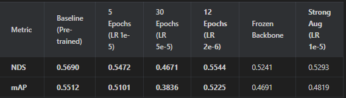
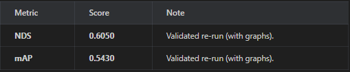
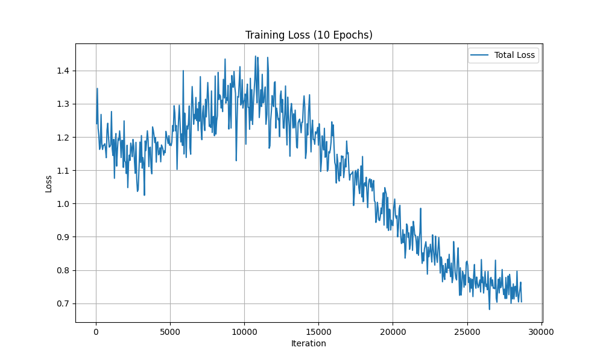
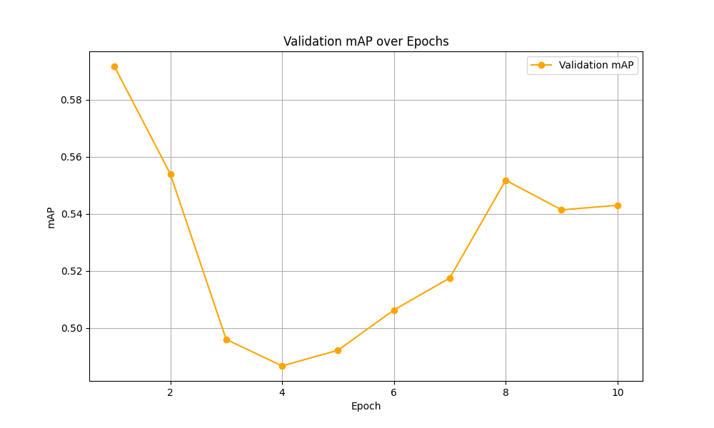

## Project Overview

**BEVMF** (Bird's-Eye View Model Framework) is a comprehensive framework for **BEV-based 3D object detection** models. This project focuses on evaluating and comparing state-of-the-art Bird's-Eye View detection models, including **BEVFusion**, PointPillars, 3DSSD, and CenterPoint.

### What is BEV (Bird's-Eye View)?

BEV (Bird's-Eye View) is a top-down representation of 3D scenes that projects 3D objects onto a 2D plane, making it easier to understand spatial relationships and object positions. BEV-based models are particularly effective for autonomous driving applications as they provide a unified representation that combines information from multiple sensors (LiDAR, cameras).

### Key Features

The framework provides:
- **BEV visualization** tools for top-down view analysis
- **Multi-model comparison** across KITTI and nuScenes datasets
- **Comprehensive evaluation metrics** (mAP, precision, recall, IoU)
- **Automated artifact export** (point clouds, bounding boxes, predictions, visualizations)
- **BEVFusion support** with custom CUDA operations compilation

The core driver is `mmdet3d_inference2.py`, a customized version of OpenMMLab's inference script with enhanced BEV visualization and export utilities. The `scripts/visualize_bev.py` script generates detailed Bird's-Eye View visualizations of detection results.

> 📊 **See [REPORT.md](REPORT.md) for comprehensive evaluation results, metrics, and analysis of all models.**

## Prerequisites

1. **Python 3.10** – installed via Microsoft Store (`winget install Python.Python.3.10`).
2. **Virtual environment** – created in the repo root: `py -3.10 -m venv .venv`.
3. **NVIDIA GPU (optional but recommended)** – for CUDA acceleration (GTX 1650 or better recommended).
4. **CUDA Toolkit 11.3+** – for GPU support (PyTorch will use CUDA 11.8 which is compatible).

### 2. Install Dependencies
#### Option 1: CPU-Only Setup (Limited - PointPillars only)
```powershell
python -m pip install -U pip
pip install -r requirements.txt
pip install torch==2.1.2+cpu torchvision==0.16.2+cpu torchaudio==2.1.2+cpu \
    --index-url https://download.pytorch.org/whl/cpu
```

#### Option 2: CUDA Setup (Recommended for BEV Models)
```powershell
python -m pip install -U pip
pip install -r requirements.txt
pip install torch==2.1.2 torchvision==0.16.2 torchaudio==2.1.2 \
    --index-url https://download.pytorch.org/whl/cu118
# Install mmcv with CUDA support (required for mmdet3d)
pip uninstall mmcv -y
pip install mmcv==2.1.0 -f https://download.openmmlab.com/mmcv/dist/cu118/torch2.1.0/index.html
```

This project relies on `mmdetection3d` and its ecosystem.

```bash
# 1. Install PyTorch (ensure CUDA match)
pip install torch==2.1.2 torchvision==0.16.2 torchaudio==2.1.2 --index-url https://download.pytorch.org/whl/cu118

# 2. Install MMEngine, MMCV, MMDetection
pip install -U openmim
mim install mmengine
mim install "mmcv>=2.0.0"
mim install "mmdet>=3.0.0"

# 3. Install MMDetection3D (from source/submodule)
cd external/mmdetection3d
pip install -v -e .
cd ../..
```

### 3. Compile BEVFusion
The BEVFusion ops must be compiled.
```bash
cd external/mmdetection3d/projects/BEVFusion
python setup.py develop
cd ../../../..
```

---

## 📊 Models & Datasets

### Dataset: nuScenes (v1.0-mini & v1.0-trainval partial)
Make sure to install a nuScenes dataset in the data/ folder. In our case we used nuScene mini and a portion of the full nuScene dataset(`blob01`).

### Model: BEVFusion (LiDAR Only)
*   **Backbone**: VoxelNet
*   **Neck**: SECONDFPN
*   **Head**: TransFusionHead
*   **Config**: `bevfusion_lidar_voxel0075_second_secfpn_8xb4-cyclic-20e_nus-3d.py`

---

## 📈 Experiment Results (Fine-Tuning)

We compared several strategies to adapt the pre-trained model to our specific data subset.

!

### Training Loss vs Epochs (Final Run)
*Loss decreased steadily, showing effective learning despite the partial dataset.*


### Validation Accuracy (mAP) vs Epochs
*Accuracy remained high, validating the "sanitized" dataset approach.*


---

## 🚀 How to Run

### 1. Fine-Tuning
To reproduce the training:

1.  **Sanitize Data**: `python sanitize_pkl.py`
2.  **Run Training**:
    ```powershell
    $env:PYTHONPATH = "external\mmdetection3d;$env:PYTHONPATH"
    python external\mmdetection3d\tools\train.py external\mmdetection3d\projects\BEVFusion/configs/bevfusion_lidar_voxel0075_second_secfpn_8xb4-cyclic-20e_nus-3d.py
    ```

